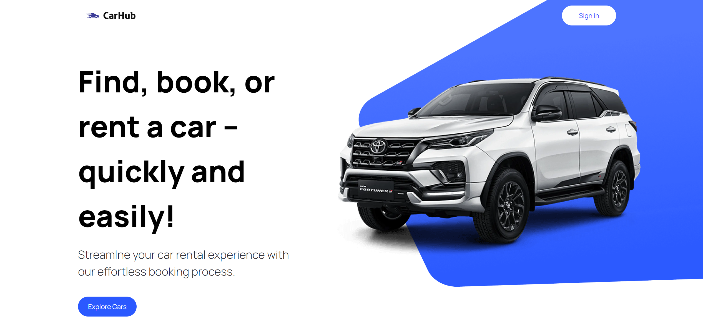
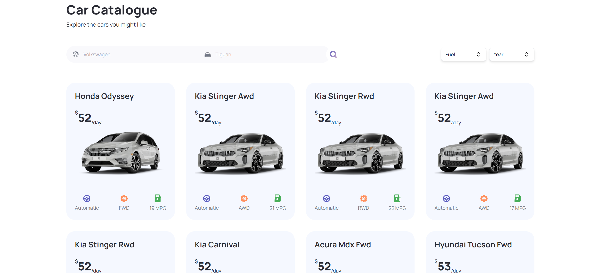
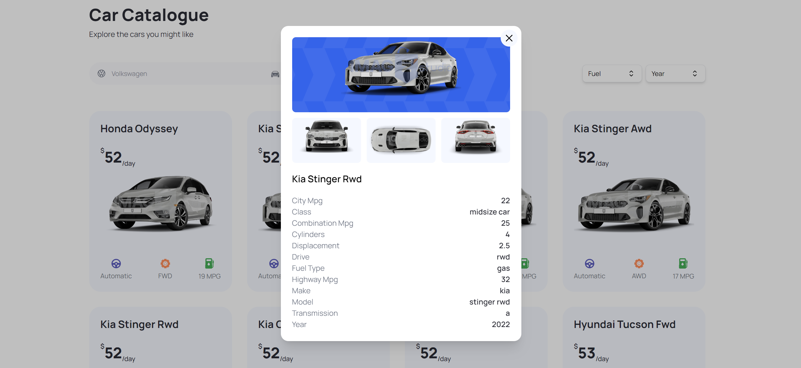
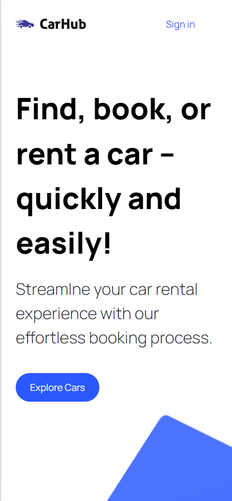
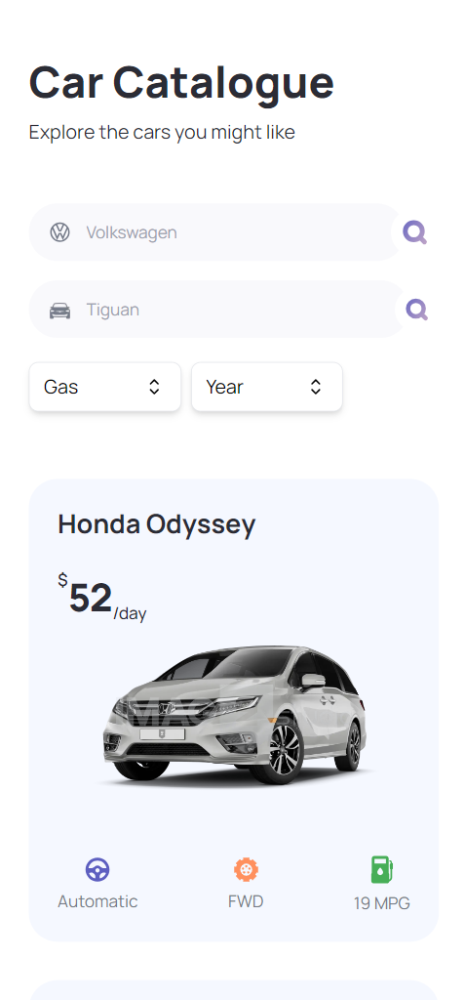
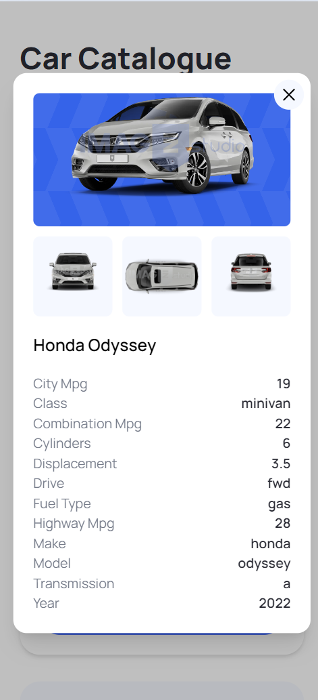

# Car Hub Website

## Introduction

Developed with Next.js and leveraging its server-side rendering capabilities, the Car Hub website presents various car types, showcasing comprehensive information in a well-designed format with advanced filtering and pagination support for an enhanced user experience.

## ⚙️ Tech Stack

- Next.js
- TypeScript
- Tailwind CSS

## 🔋 Features

### 👉 Home Page

Showcases a visually appealing display of cars fetched from a third-party API, providing a captivating introduction to the diverse range of vehicles available.

### 👉 Exploration and Filtering

Explore a wide variety of cars from around the world, utilizing a search and filter system based on criteria such as model, manufacturer, year, fuel type, and make.

### 👉 Transition to Server-Side Rendering

A seamless transition from client-side rendering to server-side rendering, enhancing performance and providing a smoother browsing experience.

### 👉 Pagination

For easy navigation through a large dataset of cars, allowing users to explore multiple pages effortlessly.

### 👉 TypeScript Types

Utilize TypeScript to provide robust typing for enhanced code quality and better development.

### 👉 Responsive Website Design

The website is designed to be visually pleasing and responsive, ensuring an optimal user experience across various devices.

